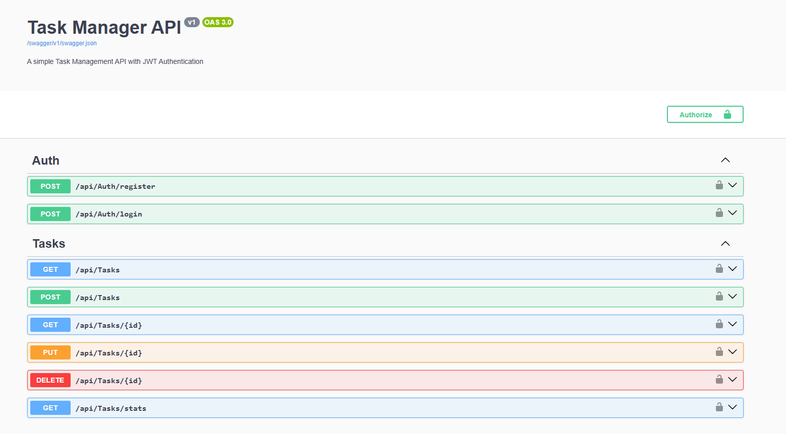

# Task Manager API

A RESTful API for task management with JWT authentication, built with ASP.NET Core & Entity Framework Code First.

---

## 🛠️ Tech Stack

- **Backend:** ASP.NET Core 8 Web API
- **Database:** SQL Server + Entity Framework Core (Code First)
- **Auth:** JWT Bearer Tokens
- **Docs:** Swagger / OpenAPI
- **Frontend:** Vanilla HTML/CSS/JS

---

## 🚀 Features

- ✅ JWT Authentication (Register / Login)
- ✅ Role-based access (Admin / User)
- ✅ Full CRUD for tasks
- ✅ Filter tasks by status & priority
- ✅ Task stats dashboard
- ✅ Auto database migration on startup
- ✅ Swagger UI with JWT support

---

## 📁 Project Structure

````
---

## ⚙️ How to Run

### 1. Prerequisites
- .NET 8 SDK
- SQL Server
- Visual Studio 2022 or VS Code

### 2. Install NuGet Packages

```bash
dotnet add package Microsoft.EntityFrameworkCore.SqlServer
dotnet add package Microsoft.EntityFrameworkCore.Tools
dotnet add package Microsoft.AspNetCore.Authentication.JwtBearer
dotnet add package BCrypt.Net-Next
dotnet add package Swashbuckle.AspNetCore
````

### 3. Configure Connection String

Edit `appsettings.json`:

```json
"ConnectionStrings": {
  "DefaultConnection": "Server=.;Database=TaskManagerDB;Integrated Security=True;TrustServerCertificate=True;"
}
```

### 4. Run the API

```bash
dotnet run
```

The API will:

- Auto-create the database via EF Migrations
- Seed a default Admin user

### 5. Open Swagger

```

```

### 6. Default Admin Login

```
Email:    admin@taskmanager.com
Password: Admin@123
```

---

## 📡 API Endpoints

| Method | Endpoint             | Auth | Description          |
| ------ | -------------------- | ---- | -------------------- |
| POST   | `/api/auth/register` | ✅   | Register new user    |
| POST   | `/api/auth/login`    | ✅   | Login & get token    |
| GET    | `/api/tasks`         | ✅   | Get tasks (filtered) |
| GET    | `/api/tasks/{id}`    | ✅   | Get task by ID       |
| POST   | `/api/tasks`         | ✅   | Create task          |
| PUT    | `/api/tasks/{id}`    | ✅   | Update task          |
| DELETE | `/api/tasks/{id}`    | ✅   | Delete task          |
| GET    | `/api/tasks/stats`   | ✅   | Get task statistics  |

---

## 🖥️ Frontend

Open `Frontend/index.html` directly in your browser.
Make sure the API URL in the JS matches your running por


## 📸 Screenshots

### Swagger UI


### Frontend


### SQL


### Authorization


